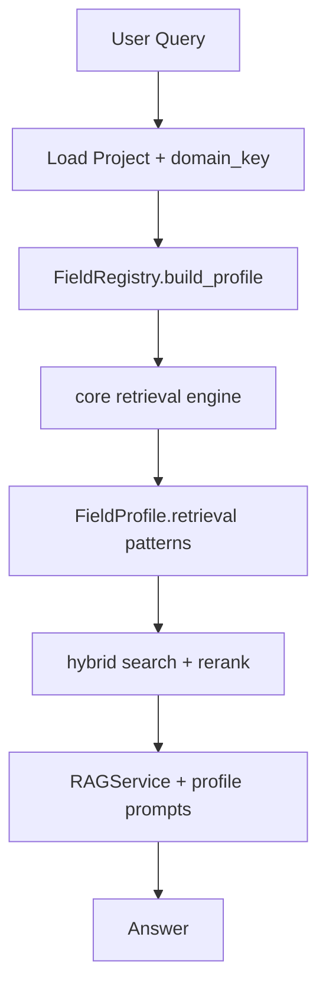

# Implementation Plan: Field Registry Architecture

**Branch**: `002-field-registry` | **Date**: 2026-06-29 | **Spec**: [spec.md](./spec.md)

## Summary

Introduce a **Field Registry** so domain differences (pharmacy, legal, medical, …) live in `src/fields/{domain}/` config packs while **one shared core pipeline** handles ingestion, retrieval, and generation. Core Python files shed embedded regex/patterns and delegate to `FieldProfile`. Projects link to a field via `project_domain_config` (DB) with optional JSON overrides. `001-pharmacy-query-enhancement` implements as the first non-generic pack after this foundation.

---

## Technical Context

**Language/Version**: Python 3.13

**Primary Dependencies**: FastAPI, SQLAlchemy 2.x, Pydantic v2, PyYAML, existing RAG stack

**Storage**: PostgreSQL — new `project_domain_config`; field packs in git (`src/fields/`)

**Testing**: pytest; per-field pack tests + core regression with `generic`

**Performance Goals**: Field profile load cached at startup; &lt;1ms merge per request

**Constraints**: Backward compatible — existing projects default to `generic`

**Scale/Scope**: 3 initial packs: `generic`, `legal`, `pharmacy`

## Constitution Check

| Gate | Pass? |
|------|-------|
| G1 Clean Architecture | ☑ `core/` + `fields/` + `services/FieldRegistry` |
| G2 Feature-First | ☑ `specs/002-field-registry/` + `tests/unit/fields/` |
| G3 SOLID / Plugins | ☑ Open/closed: new field = new folder |
| G4 Async + Types | ☑ Pydantic profiles, async unchanged |
| G5 RAG Pipeline | ☑ Hybrid/rerank preserved; prompts versioned |
| G6 Testing | ☑ Registry, merge, per-field pattern tests |
| G7 Observability | ☑ `domain_key` in logs/metrics |
| G8–G10 | ☑ |

---

## ما اللي هيتغير في الكود؟ (Refactoring Map)

### الفكرة في سطر

```text
قبل:  مجال الصيدلة + القانون مخلوطين داخل utils/retrieval.py و structural_split.py
بعد:  core/ = محرك واحد | fields/pharmacy/ + fields/legal/ = configs | controllers = تنسيق بس
```

---

### هيكل جديد

```text
src/
├── core/                              # NEW — محرك مشترك (أنظف، أقصر)
│   ├── chunking/
│   │   └── engine.py                  # splitters فقط — بدون معرفة بالمجال
│   ├── retrieval/
│   │   ├── engine.py                  # RRF, hybrid, dedupe, merge
│   │   └── classifier.py              # يقرأ patterns من FieldProfile
│   ├── structural/
│   │   └── engine.py                  # يطبّق boundary patterns من profile
│   └── metadata/
│       └── labels.py                  # format_source_label من template
│
├── fields/                            # NEW — كل مجال هنا
│   ├── registry.yaml
│   ├── _schema/
│   ├── generic/
│   │   ├── domain.yaml
│   │   ├── chunking.yaml
│   │   ├── retrieval.yaml
│   │   └── chunk_metadata.yaml
│   ├── legal/
│   │   ├── retrieval.yaml             # مادة، فصل، exhaustive legal
│   │   ├── structural_split.yaml
│   │   └── ...
│   └── pharmacy/
│       ├── chunking.yaml              # xlsx_row
│       ├── retrieval.yaml             # interactions, drug class lists
│       ├── file_roles.yaml
│       └── prompts/
│
├── services/
│   └── FieldRegistry.py               # NEW — تحميل ودمج profiles
│
├── models/db_schemes/algorag/schemes/
│   └── project_domain_config.py       # NEW — جدول DB
│
└── utils/
    ├── retrieval.py                   # SHRINK → shim يعيد التصدير من core
    └── structural_split.py            # SHRINK → shim
```

---

### ملف بملف: قبل → بعد

| ملف حالي | سطور تقريباً | بعد الت refactor | التغيير |
|----------|-------------|------------------|---------|
| `utils/retrieval.py` | ~570 | ~50 shim + ~200 في `core/retrieval/engine.py` | **−60%** من الملف الأصلي؛ patterns تنتقل لـ YAML |
| `utils/structural_split.py` | ~215 | ~40 shim + ~80 في `core/structural/engine.py` | **−65%**؛ قانون في `fields/legal/` |
| `controllers/NLPController.py` | ~600 | ~350 | يستقبل `FieldProfile` بدل استدعاء utils مباشرة |
| `services/RAGService.py` | ~270 | ~180 | `_classify_query_type` → `profile.retrieval` |
| `controllers/ProcessController.py` | ~190 | ~120 | chunking يقرأ `profile.chunking.strategy` |
| `stores/llm/templates/.../rag.py` | ~80×2 | unchanged fallback | prompts افتراضية من `fields/*/prompts/` |
| `helpers/config.py` | ~145 | +10 | `FIELDS_DIR`, `FIELDS_DEFAULT` فقط |

**المجموع المتوقع**: ~**400–500 سطر أقل** في core controllers/utils؛ المنطق ينتقل لـ **~300 سطر YAML** + **~150 سطر** loader/validation.

---

### إيه اللي **يخرج** من الكود Python؟

| كان في الكود | يبقى في |
|-------------|---------|
| `_COMPARISON_PATTERNS`, `_DETAIL_PATTERNS` (عربي/إنجليزي) | `fields/{domain}/retrieval.yaml` |
| `is_exhaustive_list_query` patterns | per-field `intents.exhaustive_list` |
| `build_structural_expansion_queries` | `fields/legal/retrieval.yaml` |
| `_STRUCTURAL_BOUNDARY`, `_ARTICLE_QUERY` | `fields/legal/structural_split.yaml` |
| XLSX one-blob logic | `fields/*/chunking.yaml` → `by_extension: .xlsx: row` |
| `focus_document_text` rules | `retrieval.disable_chunk_focus` في profile |
| Pharmacist prompt (طويل) | `fields/pharmacy/prompts/system_ar.txt` + `project_prompts` override |

---

### إيه اللي **يفضل** في الكود (مش هيتحذف)؟

| يفضل في core | ليه |
|-------------|-----|
| `hybrid_rrf`, `deduplicate_retrieved_documents` | خوارزميات عامة |
| `rerank_retrieved_documents` (RRF fusion) | لا تعتمد على مجال |
| `NLPController` orchestration (embed → search → enrich) | محرك واحد |
| `enrich_retrieved_documents` (continuation chunks) | سلوك عام مع profile flags |
| Celery tasks, vector DB clients | infrastructure |

---

### تدفق الطلب بعد التغيير



---

### DB migration

```text
alembic/versions/xxxx_add_project_domain.py
  - CREATE TYPE domain_key AS ENUM ('generic', 'pharmacy', 'legal')
  - ALTER TABLE projects ADD domain_key, config_json
  - backfill existing rows → domain_key = 'generic', config_json = '{}'
  - NO separate project_domain_config table
```

`project_prompts` unchanged — prompt text stays there.

---

### ترتيب التنفيذ (Phases)

| Phase | ماذا | ملفات تتأثر |
|-------|------|-------------|
| **A** | `FieldRegistry` + `fields/generic/` + columns on `projects` | NEW: 8–12 files |
| **B** | استخراج legal من `retrieval.py` / `structural_split.py` | MODIFY: utils → core; NEW: `fields/legal/` |
| **C** | تقليص shims؛ `NLPController`/`RAGService` يستخدموا profile | MODIFY: 3 files (−lines) |
| **D** | **Pharmacy pack** (`fields/pharmacy/`) — merged from superseded `001` | See Phase D in spec.md: `project.defaults.yaml`, `retrieval.yaml`, `query_rewrite.yaml`, row chunking, query understanding, prescription parser, pharmacist prompts, benchmarks |
| **E** | Extend project create/get with `domain_key` + `config_json` + metrics | MODIFY: ProjectController, routes |
| **F** | حذف الكود الميت من utils | DELETE: ~300 lines |

---

### علاقة بـ `001-pharmacy-query-enhancement`

```text
001-pharmacy-query-enhancement  →  SUPERSEDED (archived)
002-field-registry Phase D      →  كل محتوى الصيدلة هنا
```

لا تنفّذ 001 منفصلًا.

---

**Next**: `/speckit-tasks` على `002` فقط (يشمل Phase D للصيدلة).
