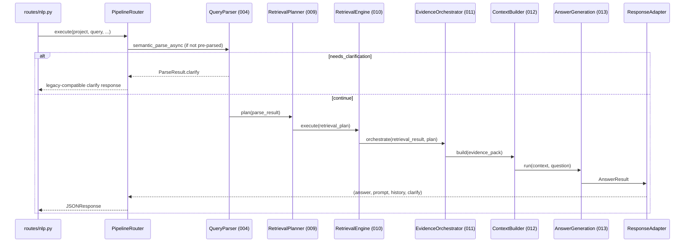

# Implementation Plan: Unified Production Pipeline Migration

**Branch**: `015-unified-pipeline-migration` | **Date**: 2026-07-15 | **Spec**: [spec.md](./spec.md)

**Input**: Architecture-only migration design replacing legacy RAG execution with unified pipeline (specs 009–014 modules), preserving Query Parser (004), API contract, feature flags, shadow mode, and rollback.

**Note**: This plan defines architecture and design artifacts only. No implementation tasks.

## Summary

Production today executes `RAGService.answer_question` → `NLPController.search_vector_db_collection`
→ `core.retrieval.*` → hand-built prompts. Specs 009–013 exist as tested but uncalled libraries
under `src/core/`. This migration introduces a **Pipeline Router** and **Unified RAG Orchestrator**
at the application layer that wires existing infrastructure through **adapters** into the SpecKit
stage graph, controlled by **`RAG_PIPELINE_MODE`** (`legacy` | `shadow` | `unified`).

Query Parser (004) remains the shared entry point. Answer Quality (014) attaches as an offline
evaluation and shadow-analysis layer, not an inline gate in v1.

## Technical Context

**Language/Version**: Python 3.13 (constitution-mandated)

**Primary Dependencies**: FastAPI, SQLAlchemy 2.x (async), Pydantic, Celery (unchanged for indexing)

**Storage**: PostgreSQL + pgvector (via existing `VectorDBProviderFactory`); shadow comparison
artifacts stored as JSON files or optional DB table (design choice in research.md)

**Testing**: pytest + pytest-asyncio; contract tests on `/answer`; golden tests via spec 014;
shadow diff integration tests

**Target Platform**: Linux Docker Compose production stack (existing)

**Project Type**: Web service (FastAPI) with modular `core/` pipeline libraries

**Performance Goals**: Shadow overhead ≤ 2× legacy p95; unified-only ≤ 1.5× legacy p95 post-tuning;
no HTTP timeout regression on `/answer`

**Constraints**: API contract frozen; rollback via config only; legacy path retained until Phase 4

**Scale/Scope**: All `/answer` traffic across all projects; ~6 core modules + 1 orchestrator +
~8 adapters; no changes to ingestion/indexing in v1

## Constitution Check

*GATE: Must pass before Phase 0 research. Re-check after Phase 1 design.*

Reference: `.specify/memory/constitution.md` (v1.0.0)

| Gate | Requirement | Pass? |
|------|-------------|-------|
| G1 Clean Architecture | Orchestrator in services; stage logic in core; adapters at boundary | ✅ |
| G2 Feature-First | Migration scoped to `services/rag/` + composition root | ✅ |
| G3 SOLID / Plugins | Adapters implement existing core protocols; wired at startup | ✅ |
| G4 Async + Types | Unified orchestrator async; typed stage artifacts | ✅ |
| G5 RAG Pipeline | Hybrid retrieval, reranking, citations preserved via adapters | ✅ |
| G6 Testing | Contract, integration, golden, shadow tests planned | ✅ |
| G7 Observability | Stage traces, shadow metrics, correlation ids | ✅ |
| G8 Security | No secrets; flags via env/config only | ✅ |
| G9 Performance | Shadow timeout budgets; no sync blocking in HTTP path | ✅ |
| G10 Stack | Python 3.13, FastAPI, PostgreSQL, Docker | ✅ |

## Project Structure

### Documentation (this feature)

```text
specs/015-unified-pipeline-migration/
├── plan.md              # This file
├── research.md          # Phase 0 — decisions on flags, shadow, adapters
├── data-model.md        # Phase 1 — orchestration entities
├── quickstart.md        # Phase 1 — validation scenarios (no impl code)
├── contracts/           # Phase 1 — orchestrator + adapter contracts
│   ├── orchestrator.md
│   ├── adapters.md
│   └── api-stability.md
└── tasks.md             # Phase 2 (/speckit-tasks — not created here)
```

### Source Code (planned layout — architecture reference only)

```text
src/
├── core/                          # UNCHANGED stage modules (009–013)
│   ├── query_parser/              # Preserved entry (004)
│   ├── retrieval_planner/
│   ├── retrieval_engine/
│   ├── evidence_orchestrator/
│   ├── context_builder/
│   └── answer_generation/
├── services/rag/
│   ├── answer_service.py          # Legacy orchestrator (retained Phase 0–3)
│   ├── rag_service.py             # NLPController (indexing + legacy retrieval)
│   ├── pipeline/                  # NEW — migration target
│   │   ├── router.py              # PipelineRouter (mode selection)
│   │   ├── unified_orchestrator.py
│   │   ├── legacy_executor.py     # Thin wrapper over RAGService
│   │   ├── shadow_runner.py
│   │   └── response_adapter.py
│   ├── adapters/                  # NEW — infra → core protocol
│   │   ├── vector_retriever.py
│   │   ├── chunk_reader.py
│   │   ├── embedding_provider.py
│   │   ├── reranker_adapter.py
│   │   └── field_context.py
│   └── composition.py             # NEW — DI factory (called from main.py)
├── helpers/config.py              # + RAG_PIPELINE_MODE settings
└── main.py                        # + app.rag_pipeline_factory at startup
```

**Structure Decision**: Single-project layout. Migration adds `services/rag/pipeline/` and
`services/rag/adapters/` without moving `core/` modules. Composition root extends `main.py`
startup following existing singleton-on-`app` pattern.

## Architecture

### Current State (Legacy)

```text
routes/nlp.py → NLPController.answer_rag_question
                    └── RAGService.answer_question
                          ├── core.query_parser (004) ✅ wired
                          ├── NLPController.search_vector_db_collection
                          │     └── core.retrieval.* (legacy RRF/expansion)
                          ├── utils.rerank
                          └── hand-built prompt → generation_client
```

### Target State (Unified)

```text
routes/nlp.py → NLPController.answer_rag_question
                    └── PipelineRouter.execute
                          ├── [legacy]  LegacyPipelineExecutor → RAGService
                          └── [unified] UnifiedRagOrchestrator
                                ├── QueryParser (004) — shared
                                ├── RetrievalPlannerPipeline (009)
                                ├── RetrievalEnginePipeline (010)
                                ├── EvidenceOrchestrator (011)
                                ├── ContextBuilderPipeline (012)
                                └── AnswerGenerationPipeline (013)
                                      └── ResponseAdapter → API tuple
```

### Layer Diagram

```text
┌─────────────────────────────────────────────────────────────┐
│ Presentation: routes/nlp.py                                  │
│   AnswerRequest / JSONResponse (UNCHANGED)                   │
└──────────────────────────┬──────────────────────────────────┘
                           │
┌──────────────────────────▼──────────────────────────────────┐
│ Application: services/rag/pipeline/                          │
│   PipelineRouter │ UnifiedRagOrchestrator │ ShadowRunner      │
│   LegacyPipelineExecutor │ ResponseAdapter                    │
└──────────────────────────┬──────────────────────────────────┘
                           │
┌──────────────────────────▼──────────────────────────────────┐
│ Domain/Core: core/{query_parser,retrieval_planner,...}       │
│   Stage pipelines + interfaces (009–013)                     │
└──────────────────────────┬──────────────────────────────────┘
                           │
┌──────────────────────────▼──────────────────────────────────┐
│ Infrastructure Adapters: services/rag/adapters/              │
│   VectorDB → IRetriever │ ChunkRepo → IChunkReader          │
│   Reranker → IReranker │ LLM → LLMInterface                 │
└─────────────────────────────────────────────────────────────┘
```

### Orchestration Sequence (Unified)



### Pipeline Router

`PipelineRouter` is the single injection point replacing direct `RAGService` instantiation in
`NLPController.answer_rag_question`.

| Mode | Behavior |
|------|----------|
| `legacy` | Delegate to `LegacyPipelineExecutor` (wraps existing `RAGService`) |
| `unified` | Run `UnifiedRagOrchestrator` only; optional fallback to legacy on error |
| `shadow` | Run legacy + unified concurrently; return legacy; persist `ShadowComparisonRecord` |

Mode resolution order:

1. `project.config_json.pipeline_mode` (if set)
2. `Settings.RAG_PIPELINE_MODE` (env)
3. Default: `legacy`

### Adapters (Infrastructure → Core Protocols)

| Adapter | Core Protocol | Wraps |
|---------|---------------|-------|
| `PgVectorDenseRetriever` | `IRetriever` | `vectordb_client.search_by_vector[_scoped]` |
| `PgVectorSparseRetriever` | `IRetriever` | `vectordb_client.search_by_text[_scoped]` |
| `MetadataFilterRetriever` | `IRetriever` | scoped/filtered search paths |
| `StructuredInteractionRetriever` | `IRetriever` | `fetch_interaction_documents` (domain hook) |
| `LegacyRerankerAdapter` | `IReranker` | `utils.rerank.get_reranker()` |
| `SqlChunkReader` | `IChunkReader` | `ChunkModel` / chunk_repository |
| `EmbeddingProviderAdapter` | `IEmbeddingProvider` | `embedding_client` |
| `FieldContextAdapter` | (planner inputs) | `FieldProfile`, `FieldManifest`, `resolve_from_plan` |
| `AnswerResponseAdapter` | (API boundary) | `AnswerResult` → legacy 4-tuple |

Adapter design rules:

- Adapters live in `services/rag/adapters/`, not in `core/`.
- Each adapter is stateless except for injected clients; project/collection resolved per call.
- Legacy `RetrievedDocument` ↔ `RawCandidate` / `EvidenceItem` mapping is centralized in one
  mapper module to avoid type duplication (addresses ARCH-01 `RetrievalResult` name collision).

### Dependency Injection

FastAPI has no DI container; follow existing `main.py` pattern:

```text
startup_span():
  app.vectordb_client      # existing
  app.embedding_client     # existing
  app.generation_client    # existing
  app.reranker             # existing
  app.field_registry       # existing
  app.rag_pipeline_factory = build_rag_pipeline_factory(app)  # NEW

build_rag_pipeline_factory(app) → RagPipelineFactory:
  - constructs RetrieverRegistry with PgVector* adapters bound to app.vectordb_client
  - builds RetrievalEnginePipeline via RetrieverRegistry.build_pipeline()
  - builds EvidenceOrchestrator via EvidenceOrchestratorRegistry (config-driven)
  - builds ContextBuilderPipeline, AnswerGenerationPipeline
  - returns PipelineRouter(legacy_executor, unified_orchestrator, shadow_runner, settings)
```

`NLPController.answer_rag_question` receives factory via:

- **Phase 0**: optional parameter with fallback to inline `RAGService` (backward compatible)
- **Phase 1+**: `request.app.rag_pipeline_factory` passed from route

Registries MUST be constructed per-factory, not import-time globals (addresses ARCH-05).

### Feature Flags

| Setting | Type | Default | Purpose |
|---------|------|---------|---------|
| `RAG_PIPELINE_MODE` | `legacy\|shadow\|unified` | `legacy` | Global pipeline selector |
| `RAG_PIPELINE_FALLBACK_ON_ERROR` | bool | `true` | Unified/shadow: fall back to legacy on exception |
| `RAG_PIPELINE_SHADOW_PERSIST` | bool | `true` | Write shadow comparison artifacts |
| `RAG_PIPELINE_SHADOW_DIR` | str | `.rag_shadow/` | Shadow artifact directory |
| `RAG_PIPELINE_UNIFIED_TIMEOUT_S` | float | `45.0` | Shadow/unified timeout budget |
| `RAG_PIPELINE_CANARY_PROJECT_IDS` | str | `""` | Comma-separated project ids forced to unified |

Per-project override: `project.config_json.pipeline_mode`.

### Shadow Mode

Shadow execution model:

1. Start legacy and unified tasks via `asyncio.gather(..., return_exceptions=True)`.
2. Apply per-path timeout (`RAG_PIPELINE_UNIFIED_TIMEOUT_S`).
3. User response = legacy result (always).
4. If unified completes: compute `ShadowComparisonRecord` (answer similarity, citation overlap,
   stage latencies, plan_id presence).
5. Increment `RAG_SHADOW_DIVERGENCE_TOTAL` when answers differ beyond normalized threshold.
6. Unified failure in shadow does NOT affect user response.

### Rollback

Rollback = set `RAG_PIPELINE_MODE=legacy` (env or config reload). No code path removal required.
Runbook:

1. Flip flag in deployment env / Compose override.
2. Restart API workers (or hot-reload if settings support).
3. Verify `rag_pipeline_mode{mode="legacy"}` metric = 100% of requests.
4. Optionally disable shadow persistence.

### API Contract Preservation

Frozen elements (see `contracts/api-stability.md`):

- **Request**: `AnswerRequest` — `text`, `limit`, `session_id`, `metadata_filter`
- **Response**: `signal`, `answer`, `needs_clarification`, `full_prompt`, `chat_history`
- **Status codes**: 200 success/clarify; 400 `RAG_NO_CONTEXT`, `RAG_ANSWER_ERROR`

`ResponseAdapter` is the only module allowed to translate internal types to this contract.

## Migration Phases

| Phase | Name | Goal | Exit Criteria |
|-------|------|------|---------------|
| **0** | Foundation | Adapters, factory, router shell, flags default `legacy` | Contract tests pass; unified callable in dev with flag |
| **1** | Shadow | Dual-run in staging; persist diffs | 7-day shadow run; < 5% unified hard failures; divergence report reviewed |
| **2** | Canary | `unified` for allowlisted projects or 5% traffic | Golden pass rate within 5% of legacy; p95 within budget |
| **3** | Primary | Default `unified`; legacy fallback on error | ≥ 95% unified; rollback drill passed |
| **4** | Cleanup | Remove legacy answer path; deprecate `core/retrieval` for answers | All [Phase 4 exit criteria](#phase-4-exit-criteria-legacy-removal) met |

Phase 0–3 are in scope of this architecture. Phase 4 is explicitly deferred.

### Phase 4 Exit Criteria (Legacy Removal)

Legacy answer-path code MUST NOT be deleted until **all** criteria below are met for a
continuous 30-day window in production:

| # | Criterion | Measure |
|---|-----------|---------|
| C1 | Unified traffic share | ≥ 99% of `/answer` requests with `mode=unified` (fallback events < 1%) |
| C2 | Golden quality | Unified `EvaluationResult.pass_rate` ≥ legacy baseline (not baseline − 5%) |
| C3 | Shadow divergence | Median `retrieval_overlap` ≥ 0.7 and median `answer_similarity` ≥ 0.85 on sampled shadow traffic |
| C4 | Incident-free | Zero Sev-1/Sev-2 incidents attributed to unified pipeline |
| C5 | Rollback unused | No `RAG_PIPELINE_MODE=legacy` flip in the window |
| C6 | Fallback rate | `pipeline_fallback_total / unified_requests` < 0.5% |
| C7 | Operational sign-off | Explicit maintainer approval documented in Phase 4 PR |

Phase 4 scope remains a **separate PR/spec amendment** — these criteria gate it, not expand
v1 implementation.

### Phase 0 Deliverables (Architecture Targets)

- `RagPipelineFactory` + `PipelineRouter`
- All adapters specified in `contracts/adapters.md`
- `UnifiedRagOrchestrator` stage graph (no legacy duplication of parser)
- `ResponseAdapter`
- Metrics: `rag_pipeline_mode`, `rag_pipeline_stage_duration_seconds`

### Phase 1 Deliverables

- `ShadowRunner` + `ShadowComparisonRecord` persistence
- Dashboard/alerts on divergence rate and unified error rate
- Offline replay script: re-run shadow artifacts through Answer Quality (014)

## Validation Strategy

| Layer | Method | Artifact |
|-------|--------|----------|
| API contract | pytest schema assertions on `/answer` responses | `tests/contract/test_answer_api.py` |
| Stage wiring | Integration test with unified mode; assert trace stages | `tests/integration/test_unified_pipeline.py` |
| Shadow | Dual-run test; assert user response == legacy | `tests/integration/test_shadow_mode.py` |
| Golden quality | 014 fixtures → `EvaluationResult` | `tests/fixtures/answer_quality/` |
| Parser preservation | Same `ParseResult` hash for shared inputs in legacy vs unified | unit test |
| Rollback | Flag flip test; metric assertion | integration test |

## Regression Strategy

1. **Baseline capture**: Before Phase 1, run golden fixtures against legacy; store
   `EvaluationResult` as baseline via `IRegressionStore`.
2. **Shadow continuous diff**: Nightly job aggregates `ShadowComparisonRecord` → divergence report.
3. **Pre-merge gate**: CI runs golden tests in `unified` mode; fail if pass rate drops below
   `baseline - regression_threshold`.
4. **Post-cutover monitor**: 30-day regression watch comparing weekly `EvaluationResult` aggregates.
5. **Legacy snapshot tests**: Freeze representative legacy answers (sanitized) for diff detection
   during shadow phase only — not long-term maintenance.

## Production Rollout

| Week | Action | Mode |
|------|--------|------|
| 1 | Deploy Phase 0 to staging | `legacy` |
| 2 | Enable shadow in staging | `shadow` |
| 3–4 | Shadow in prod (optional 1% sample if perf concern) | `shadow` |
| 5 | Canary project allowlist | mixed |
| 6 | Default unified with fallback | `unified` |
| 7+ | Monitor; plan Phase 4 cleanup | `unified` |

Go/No-Go gates:

- Golden pass rate ≥ baseline − 5%
- Zero API contract test failures
- Rollback drill documented and tested
- On-call runbook for `RAG_PIPELINE_MODE` flip

## Complexity Tracking

| Violation | Why Needed | Simpler Alternative Rejected Because |
|-----------|------------|--------------------------------------|
| Dual pipeline maintenance (Phase 0–3) | Safe migration requires legacy availability | Big-bang swap risks production outage with no rollback |
| Shadow dual-run cost | Needs production representative comparison | Offline-only eval misses real traffic patterns and parser edge cases |
| Adapter layer | Core protocols don't match infra types | Changing core to import stores violates constitution G1/G3 |

## Post-Design Constitution Re-Check

All gates remain ✅. Adapter placement respects dependency direction. No new provider logic
in `core/`. API contract unchanged. Testing and observability explicitly planned.
